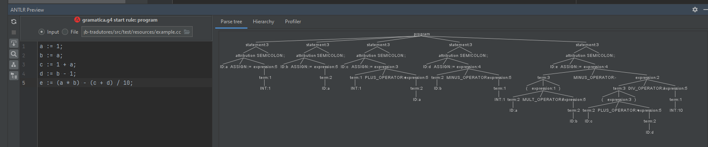
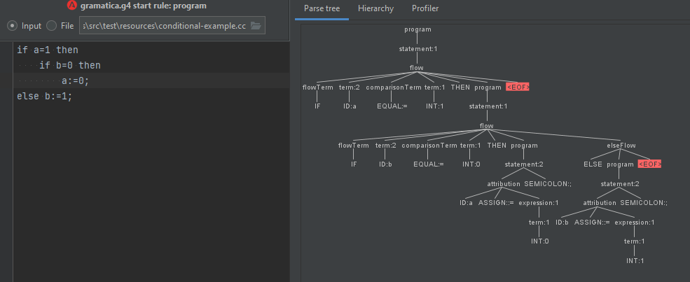
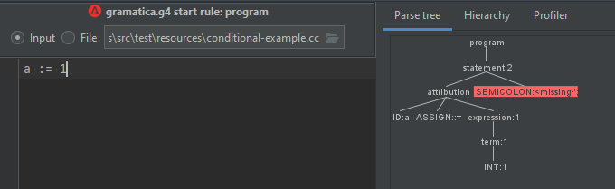
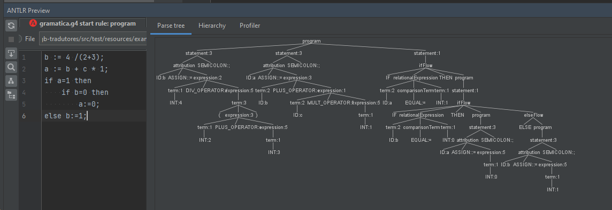

# GCL com ANTLR

Sumário:
* Utilizado ANTLR 4
* Build: mvn generate-sources install
* Execute: utilizar preview do ANTLR v4 do inteliJK 

Árvores do Lexer/Parser (preview no inteliJ não apresenta saídas, mas foram implementadas):

**Identificar atribuição de variáveis para valores constantes e/ou expressões.**

**Identificar comandos de teste & expressões relacionais**

**Identificar comandos de iteração**

**Considerando todos juntos** 

**Para outro exemplo fornecido**
