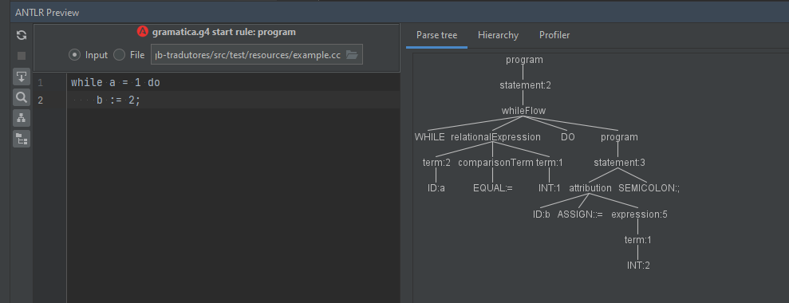
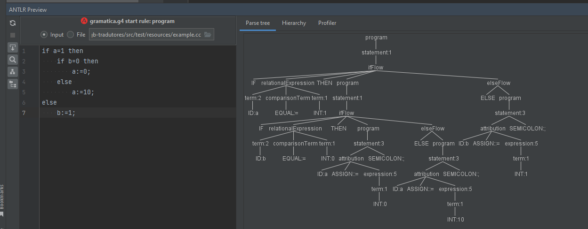
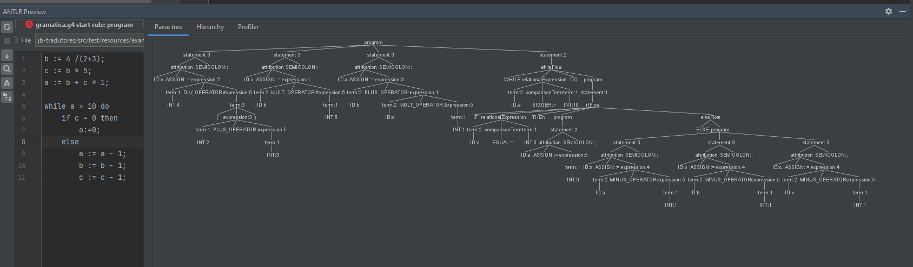

# trab-gb-tradutores
trab-gb-tradutores

Evidências

Avaliação de variáveis e constantes é inerente dos testes executados a baixo.

**Avaliação de Comando de atribuição & Expressão aritmética**

**Avaliação de Comandos de teste & Expressão relacional**

Considerando (nested ou não): IF THEN END, IF THEN ELSE END

Considerando: WHILE DO

**Avaliação de erros**

if/else faltando end

Atribuição faltando ';', ids, valores, ':=', utilizando '='

